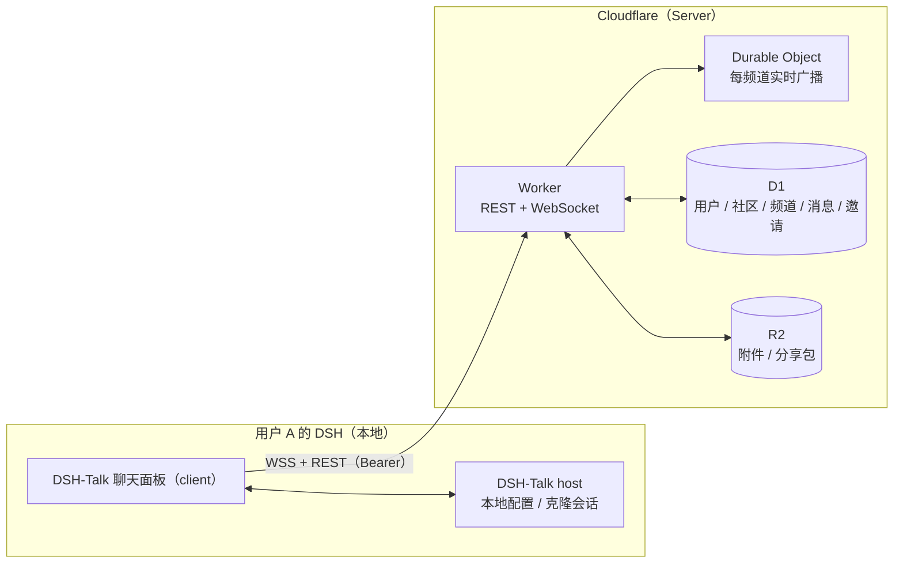

# DSH-Talk

> 把「社区」装进 DSH —— 在 DeepSeek Harness 里直接和同好聊天、提问求助、发通知，社区内容与你的 Agent 工作区不再割裂。

一个面向 DSH 用户的类 Discord 社区插件：注册一个社区账号后，就可以在 DSH 面板里自建或加入社区，实时聊天、贴图传文件、`@` 提醒、管理成员，全程不需要跳出 DSH。

---

## 使用场景：插件作者的官方社区

DSH-Talk 最典型的用法，是插件作者把社区直接开在自己的 DSH 里，让用户不用跳出去就能和你沟通：

- **发版公告**：建一个「公告」频道，它默认对 `@everyone` 只读，只有你（或你授权的角色）能发帖；用户进社区即订阅，更新、迁移说明、已知问题都发这里。
- **收集反馈与报障**：用户贴图传文件描述问题；你也可以用「分享 DSH 会话」把本机复现出问题的会话打包发到社区，对方点开卡片即可克隆到本地复现，省掉一堆来回追问。
- **话题分流**：每个功能 / 每个 bug 开一个讨论组，独立成串、24 小时无人回复自动归档，不会被刷屏淹没。
- **角色分层与提醒**：用角色区分维护者 / 内测 / 普通用户，需要全员注意时再用 `@everyone`，减少打扰。
- **私密协作**：私密社区 + 邀请码，或带密码的私密讨论组，用于内测群的封闭讨论。

同样的模型也适用于团队内部沟通、兴趣小组或课程答疑 —— 只要有 DSH，就能当社区客户端用。

--- 

## 应用截图


---

## 功能清单

### 账号与身份
- [x] 邮箱注册：注册后发送 **6 位验证码**，验证通过才能登录
- [x] 邮箱 + 密码登录，会话安全保存（Bearer）
- [x] 忘记密码：通过邮箱验证码在面板内**直接重置密码**（无需打开邮件链接）
- [x] 修改用户名、上传 / 更换头像
- [x] 退出登录

### 社区
- [x] 一键创建社区（公开 / 私有），自动生成**固定不变**的邀请码与默认频道；并自动在「公告」频道发一条**置顶开箱指南**，新社区不会是空白
- [x] 公开社区直接加入；私有社区凭邀请码加入
- [x] **发现公开社区**：侧栏「＋」弹窗切到「发现」，浏览公开社区目录、按名称 / 简介搜索，已加入的一键进入；列表展示**活跃度**（最近发言时间、近 7 天消息数）并支持热门 / 活跃 / 最新排序，官方社区置顶并带「官方」标记
- [x] **官方社区种子**：部署者可用管理接口一次性幂等写入官方社区（含各频道置顶说明帖），给新用户一个有内容的落脚点
- [x] 我的社区列表：未读频道数 + `@` 提及未读数一目了然
- [x] 编辑社区名称 / 简介 / 可见性 / 头像
- [x] 成员管理：成员列表与搜索、按角色分配 / 收回、移除成员、**转让所有权**
- [x] **封禁 / 解封**：把成员拉黑以阻止其重新加入，随时可在成员面板解封
- [x] 所有者可**删除社区**（频道、消息、成员级联清除）
- [x] 加入 / 自建社区数上限（各 20 个）；自建另受**每 24 小时 5 个**的滚动频率限制，防止滥用

### 频道
- [x] 三种互斥频道定位，侧边栏按类型区分图标：
  - 文字 —— 全员自由发言
  - 公告 —— 默认对 `@everyone` **只读**，仅所有者或经频道权限放行「发送消息」的角色 / 成员可发
  - 话题 —— 频道主面板即话题列表，点进某条话题才聊天（24h 无人回复自动归档）
- [x] 频道的创建、改名、改主题、改类型、删除、排序（上移 / 下移）

### 角色与权限
- [x] Discord 式角色模型：每个社区自带 `@everyone`（隐式作用于全体成员）与一个预设「管理员」角色（就是普通角色，权限按建社区时的全部权限位初始化，可改名可删除可改权限，需手动分配）
- [x] 自定义角色：新建 / 改名 / 配色 / 删除、上移 / 下移调整层级；成员可同时持有多个角色，基础权限按并集计算
- [x] 细粒度权限位：查看频道、发送消息、发起 / 管理讨论组、管理消息 / 频道 / 社区 / 角色、邀请成员、踢人、封禁
- [x] **频道权限覆盖**：针对 `@everyone` / 角色 / 成员单独设置 allow / deny（仅频道级权限位）
- [x] 层级防提权：只能操作层级**严格低于**自己的角色与成员，也不能授予自己没有的权限位
- [x] 权限变更实时下发：在线连接被重新校验，失去频道可见性的连接会被主动断开

### 讨论组（话题）
- [x] 文字 / 话题频道下可开讨论组：独立成串、24 小时无人发言自动归档（发言即恢复）
- [x] **可见性**：公开（社区成员自由进出）/ 私密（非成员可见但加锁）
- [x] 私密组可设**进入密码**：有密码可凭密码进入；未设密码则只能由组内成员拉入
- [x] 组内成员可从社区成员中拉人、移出成员；成员可自行退出

### 消息
- [x] 文本消息，`@成员` 提及并高亮提醒；`@everyone` 可**全员提醒**（计入提及未读）
- [x] 附件：图片（内联预览）与任意文件（下载），一条消息最多 4 个；支持**粘贴 / 拖拽**直接加入待发送附件
- [x] 编辑 / 删除消息（作者本人，或拥有「管理消息」权限的人）
- [x] **消息置顶**：有「管理消息」权限的人可置顶 / 取消置顶，头部置顶面板可查看并跳转到原消息
- [x] **表情回应**：给消息加 emoji（同人同 emoji 再点即取消），按 emoji 聚合并实时同步
- [x] **消息搜索**：按关键词模糊匹配社区内消息正文；可用频道 / 作者 / 时间范围（24h / 7d / 30d）/ 仅 `@我` 收窄范围，倒序返回
- [x] 实时收发：新消息、编辑、删除、表情回应即时同步到所有在线成员

### 实时与未读
- [x] 每个频道一条 WebSocket 长连接，心跳保活、断线自动重连（重连后自动补拉断线期间的消息）
- [x] **输入中状态**：同房间成员正在输入时，输入框上方显示「xxx 正在输入…」
- [x] 频道头部显示当前**在线人数**，点开可看在线成员与状态（在线 / 离开随窗口焦点自动切换）
- [x] **社区在线聚合**：跨频道与活跃讨论组按用户去重，侧栏与成员面板展示社区在线成员
- [x] 已读状态上报；社区栏未读气泡与 `@` 提及提醒（频道与讨论组各一套）

### 邀请与站内信
- [x] 邀请已注册用户加入（用户名或邮箱）→ 对方收到**站内信 + 邮件**
- [x] 收件箱：接受 / 拒绝邀请、已处理状态、一键全部已读、铃铛未读角标

### 分享
- [x] **分享 DSH 会话**：把本机一个 DSH 会话打包分享到社区；他人点开卡片弹窗即可「克隆到本地的会话」
- [x] **分享卡片**：发消息时可附带一张自己创建的分享，卡片内嵌在消息里；点击卡片弹出详情（分享者 / 大小 / 时间 / 事件数），可下载包体

---

## 安装插件

把插件装进你自己的 DSH profile 即可。

前置条件：
- Node ≥ 20
- 已安装 pnpm
- `npx @deepseek-ai/dsh`。

### 安装到 profile

```bash
# 从 GitHub 装进 web profile
npx @deepseek-ai/dsh plugin --profile web add github:seolhw/dsh-talk

# 启动 DSH Web
npx @deepseek-ai/dsh web
```

### 代理设置（可选）

Server 地址为 `https://dsh-talk-api.huiwang.fun` ，部署在 Cloudflare 上，国内直连可能不稳定；在代理工具里让这个域名**走代理**（注意别误加进直连 / 绕过列表，也别被广告拦截规则 REJECT）即可。

浏览器打开 `https://dsh-talk-api.huiwang.fun/healthz` 能返回 JSON，即说明链路已通。

### 首次使用

1. 启动后侧栏底部出现 **DSH-Talk（社区）** 入口，即安装成功。
2. 在面板内用邮箱注册账号，查收 6 位验证码完成验证，然后创建或加入社区。

### 升级与卸载

```bash
npx @deepseek-ai/dsh plugin --profile web update dsh-talk    # 拉到仓库最新提交
npx @deepseek-ai/dsh plugin --profile web remove dsh-talk    # 卸载（同时从 dsh.profile.bundles 移除）
```

> 想在本仓库里边改边跑（热重载、watch 打包），或者想自己托管 Server，见下面的「更多文档」。

---

## 架构一览



- **client（浏览器）**：聊天界面、WebSocket 实时连接、附件直传、站内信。
- **host（Node.js）**：保存 serverUrl / token 等本地设置；读本机 DSH 会话并打包成分享包，也能把分享包还原成本地会话。
- **server（Cloudflare）**：唯一的数据中心——REST + WebSocket API、每频道一个 Durable Object 做实时扇出、D1 存业务数据、R2 存附件与分享包；完全自包含，可按 [自部署 Server](docs/deploy.md) 自己托管一个。

---

## 插件设置（DSH 设置页）

| 键 | 默认 | 说明 |
| --- | --- | --- |
| `serverUrl` | `https://dsh-talk-api.huiwang.fun` | Server 地址；自托管就改成自己的域名 |
| `handle` | `""` | 当前账号用户名（登录后自动写入） |
| `token` | `""`（secret） | 会话令牌，登录后自动写入 |
| `autoReconnect` | `true` | WebSocket 断线自动重连 |
| `share.maxSizeMb` | `50` | 会话分享包体积上限 |

首次启动会把默认的 `serverUrl` **写进 DSH 的 settings 文档**（`$DSH_HOME/settings.yaml` 的 `talk` 段），之后它就以这份配置为准：

```yaml
talk:
  serverUrl: https://dsh-talk-api.huiwang.fun
```

想连别的后端（自托管 / 本地 Server），在 **DSH 设置页的插件设置**里改，或直接改上面这个文件 —— 不用改代码，改过的值不会被启动流程覆盖。本地开发另有 `BETTER_AUTH_URL` 环境变量作为**临时覆盖**（见 [参与开发](docs/development.md)），它只影响当次进程、不写进 settings 文档。

### Server 环境变量

Server 端的 `BETTER_AUTH_SECRET` / `BETTER_AUTH_URL` / `RESEND_API_KEY` / `ADMIN_TOKEN` 与业务限额，见 [自部署 Server](docs/deploy.md#环境变量)。

---

## 更多文档

| 文档 | 内容 |
| --- | --- |
| [参与开发](docs/development.md) | 仓库结构、本地跑通全栈（`pnpm build` / `pnpm dev` / `pnpm dev:server`）、overlay 加载机制、常用命令与提交约定 |
| [自部署 Server](docs/deploy.md) | 把 Server（Hono Worker + D1 + R2 + Durable Object）部署到自己的 Cloudflare 账号；环境变量、发信配置与官方社区种子 |

---

## License

MIT
